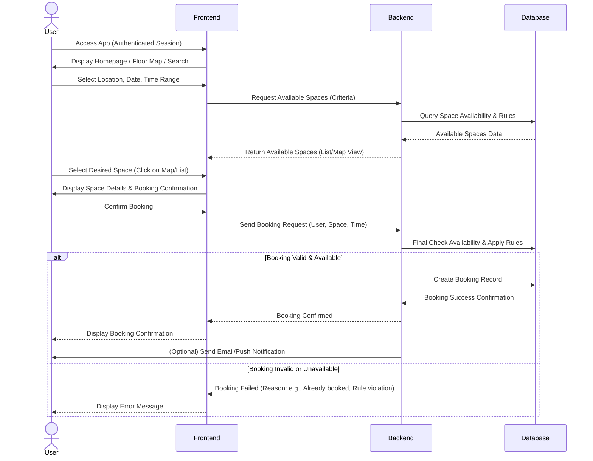
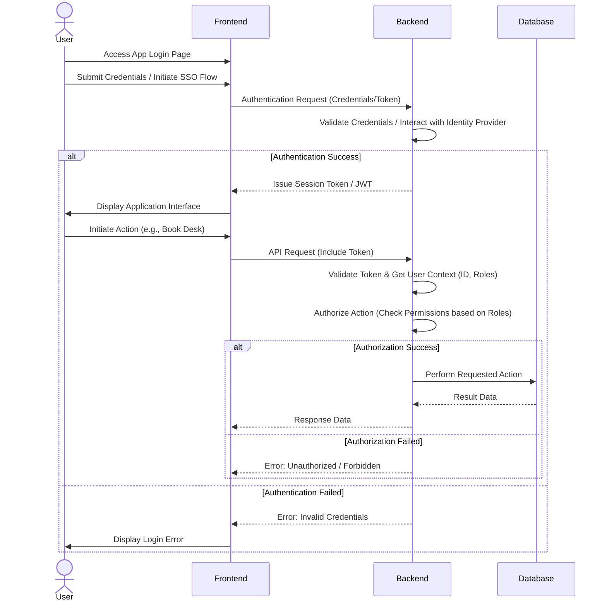

Okay, here is the system flow documentation for the Room and Desk Booking App, formatted as requested in Markdown with Mermaid diagrams.

```markdown
# Room and Desk Booking App - System Flow Documentation

**Version: 1.0**
**Date: June 9, 2025**

## 1. System Overview

The Room and Desk Booking App is provided as a Cloud Service (SaaS) by a vendor to BIG direkt gesund. The vendor is responsible for the full technical operation of the service, including infrastructure, installation, maintenance, updates, and issue resolution.

The system primarily facilitates the booking of desks and project rooms by employees across two locations (Dortmund, Düsseldorf) and provides administrators with tools to manage spaces and view utilization.

**Key Components:**

*   **User Interface (Frontend):** Web-based interface for users (employees) and potentially administrators to access and interact with the system. Accessible via standard web browsers.
*   **SaaS Application Backend:** The core application logic, including APIs, booking engine, business rules, security handling, and data processing. Hosted and managed by the vendor in the cloud.
*   **SaaS Database:** Stores all system data, including user information (likely synchronized or managed), locations, floor plans, desk and room configurations, booking records, rules, and audit logs. Hosted and managed by the vendor.
*   **Administrator Interface (Optional/Integrated):** A part of the Frontend or a separate interface used by key users/administrators for configuration, user management (if applicable), and reporting.
*   **Support System:** Vendor's system for receiving, tracking, and resolving support issues reported by the client. (Interaction is outside the core booking flow but crucial for the overall service).

**System Interactions (High-Level):**

```mermaid
graph LR
    A[Employee User] --> B[User Interface]
    B --> C[SaaS Application Backend]
    C --> D[SaaS Database]
    Admin[Administrator] --> E[Admin Interface]
    E --> C
    BIG[BIG direkt gesund Staff] --> F[Vendor Support System]

    subgraph SaaS Cloud Service (Vendor Managed)
        C
        D
    end
```

## 2. User Workflows

The primary user workflows involve viewing available spaces and making bookings.

**Core User Journeys:**

*   **Login & Authentication:** Access the system securely.
*   **View Available Spaces:** Browse or search for available desks or project rooms based on criteria like location, date, time, space type, or features.
*   **Book a Space:** Select an available space and confirm the booking.
*   **Manage Bookings:** View, modify (if rules allow), or cancel existing bookings.
*   **View Floor Plans:** Visually see the layout of areas and the status of spaces.

**Critical Workflow: Booking a Desk/Room**

This sequence outlines the steps a user takes to book a space:



## 3. Data Flows

Data flows primarily between the User Interface, the Backend, and the Database within the vendor's SaaS environment.

**Key Data Flows:**

*   **User Authentication Data:** Credentials or token exchanged between Frontend and Backend during login.
*   **Space Configuration Data:** Location details, floor plans, desk/room properties, capacity, features. Flows from Database -> Backend -> Frontend for display. Managed via Admin Interface -> Backend -> Database.
*   **Booking Data:** User ID, Space ID, Start/End Time, Date, Status (Confirmed, Cancelled). Flows from Frontend -> Backend (Booking Request), Backend -> Database (Write), Database -> Backend -> Frontend (Read for viewing bookings).
*   **Rules Data:** Booking rules (e.g., max booking duration, lead time, cancellation policy). Stored in Database, applied by Backend during booking requests. Managed via Admin Interface -> Backend -> Database.
*   **Utilization Data:** Aggregated booking data for reporting. Flows from Database -> Backend -> Admin Interface for reporting.
*   **Audit Logs:** Records of user actions (bookings, cancellations, etc.) and system events. Flows from Backend -> Database (or dedicated logging system).

**Critical Data Flow: Booking Creation**

This diagram illustrates the movement of data when a user creates a booking:

```mermaid
graph LR
    A[User Input (Frontend)] --> B{Booking Request Data<br>(User ID, Space ID, Time, Date)}
    B --> C[SaaS Application Backend]
    C --> D[SaaS Database]
    D --> C: Query Space Config & Rules
    D --> C: Check Availability
    C --> D: Write Booking Record
    D --> C: Booking Confirmation Data
    C --> E{Response Data<br>(Booking Confirmation / Error)}
    E --> F[User Display (Frontend)]
    C --> G[Audit/Activity Log]
    G --> D: Write Log Entry
```

## 4. Error Handling

Error handling is crucial for a robust system. Given it's a SaaS, the vendor is responsible for backend error handling, logging, and monitoring, while the Frontend handles presentation of errors to the user.

**Strategies:**

*   **User Input Validation:** Frontend performs basic validation (e.g., required fields, date format). Backend performs comprehensive validation (business rules, availability checks, valid dates/times, user permissions). Clear, user-friendly error messages are returned to the Frontend.
*   **Backend System Errors:**
    *   Database errors: Handled by the Backend with appropriate logging and graceful failure (e.g., inform the user the service is temporarily unavailable). Vendor monitoring systems alert operations staff.
    *   Application errors: Exception handling, detailed logging, automated alerts to vendor support.
    *   External service errors (if any): Implement timeouts, retries, and fallback mechanisms.
*   **Business Logic Errors:** Specific error messages indicating why a booking failed (e.g., "Space already booked", "Booking violates policy", "You cannot book in the past").
*   **Authentication/Authorization Errors:** Redirect to login or display "Access Denied" messages.
*   **Logging and Monitoring:** Comprehensive logging of all errors, warnings, and critical events. Automated monitoring (e.g., application performance, database health, server resources) by the vendor.
*   **User Notification:** Display clear, actionable error messages in the Frontend. Avoid technical jargon.
*   **Support Integration:** Vendor's monitoring systems and user-reported issues (via portal/email per SLA) trigger alerts and actions by the vendor's support team according to defined SLAs.

## 5. Security Flows

Security is managed within the SaaS platform by the vendor, ensuring data protection and access control.

**Key Security Flows & Mechanisms:**

*   **Authentication:**
    *   Users authenticate against the system. This could be username/password or potentially integrated with BIG's identity provider (if specified in the Leistungsverzeichnis, otherwise standard authentication).
    *   Upon successful authentication, the Backend issues a session token or JWT (JSON Web Token).
*   **Authorization:**
    *   The system employs Role-Based Access Control (RBAC). Roles typically include "Employee" (standard user) and "Administrator" (or similar).
    *   Each request from the Frontend to the Backend includes the user's session token/JWT.
    *   The Backend validates the token and determines the user's identity and roles.
    *   Before processing any request (e.g., creating a booking, viewing reports), the Backend checks if the authenticated user's role(s) have the necessary permissions for that specific action and data.
*   **Data Protection (In Transit):**
    *   All communication between the User Interface (Frontend) and the SaaS Application Backend is secured using HTTPS/SSL/TLS encryption.
*   **Data Protection (At Rest):**
    *   Data stored in the SaaS Database is encrypted at rest.
    *   Vendor infrastructure security measures protect the underlying storage.
*   **Access Control (Infrastructure):**
    *   Vendor implements strict access controls to their cloud infrastructure and the SaaS application's backend and database, limiting access only to authorized vendor personnel for operations and maintenance.
*   **Auditing:**
    *   Security-relevant events (login attempts, failed logins, administrative actions, critical data modifications) are logged for auditing purposes.

**Authentication and Authorization Flow:**



This document provides a high-level overview of the system's key flows and architecture. More detailed technical specifications, integration details, and specific booking rules are expected in the "Leistungsverzeichnis".
```
